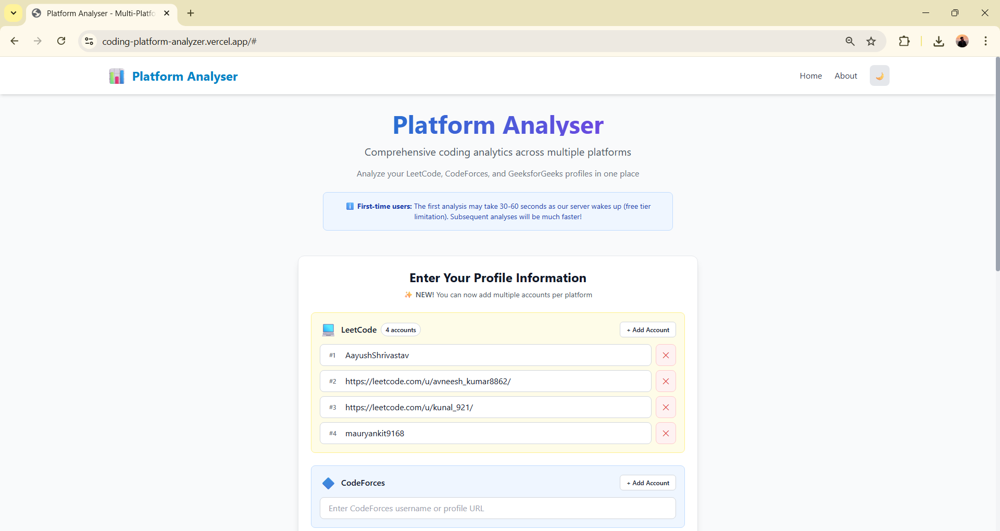
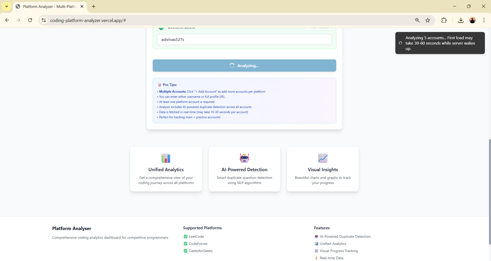
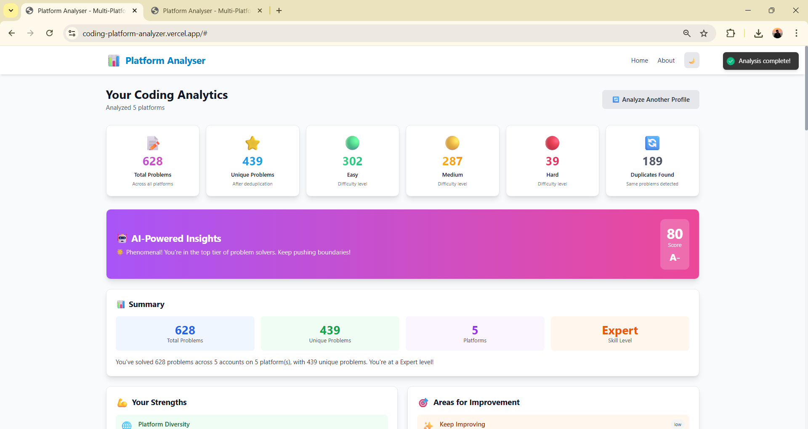
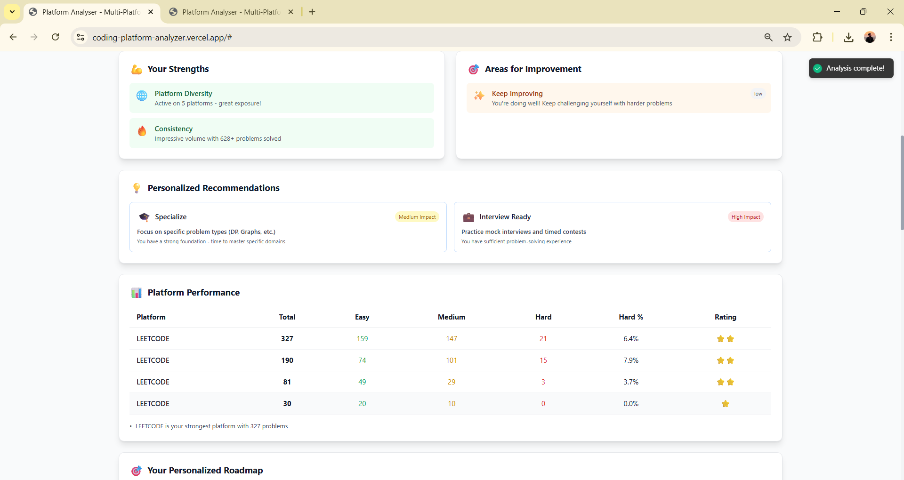
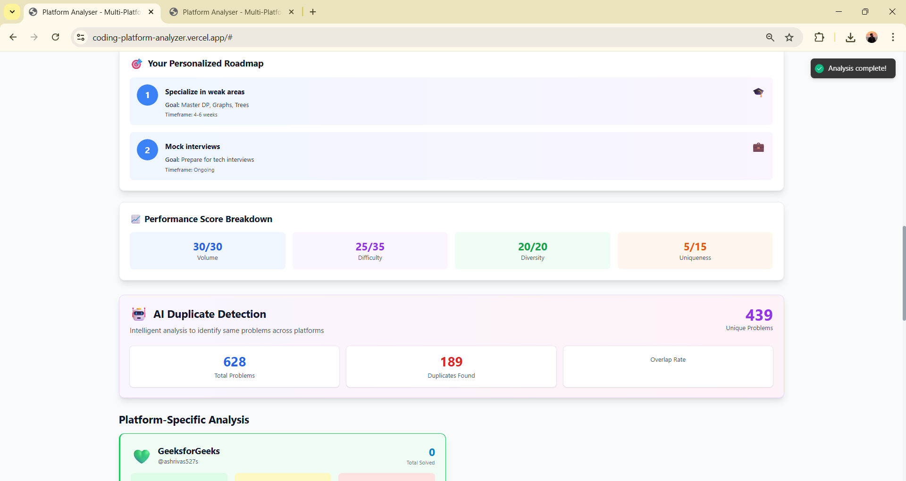
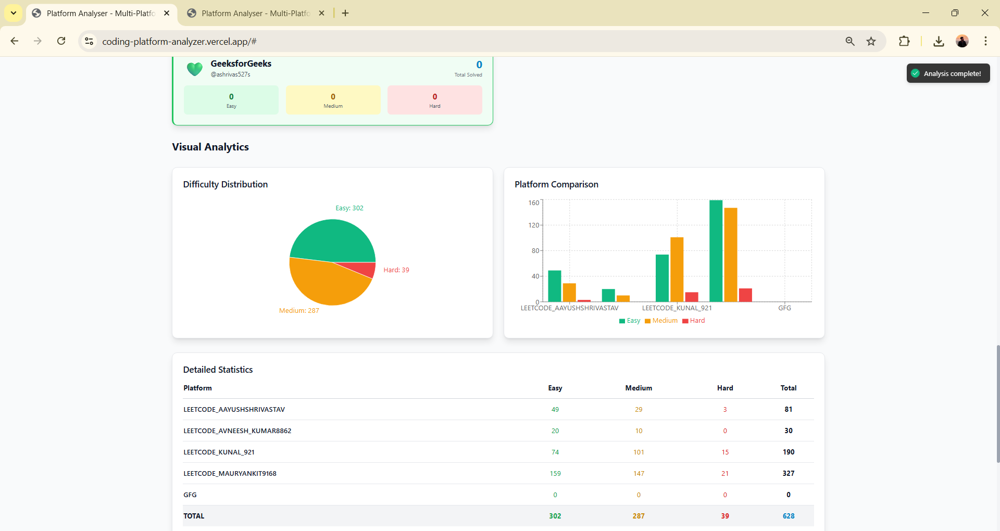
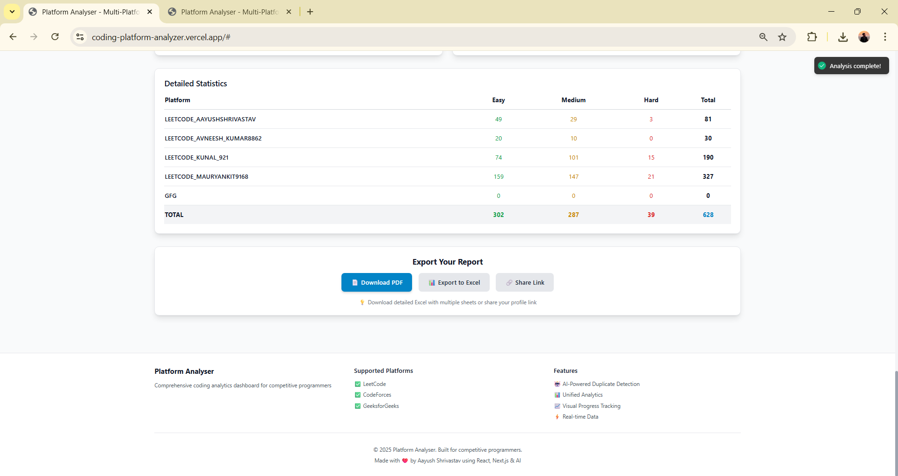
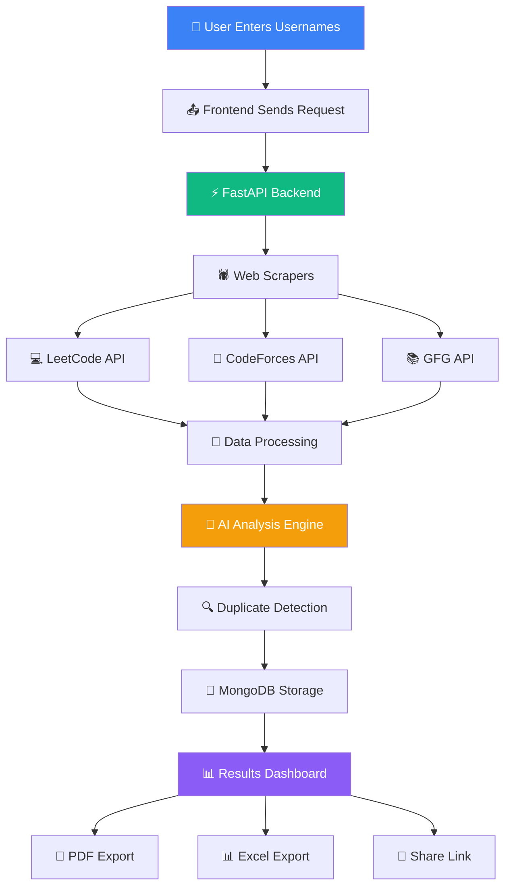

<div align="center">


<p align="center">
  
  
  
</p>

### 🌟 Unify Your Competitive Programming Journey

**A powerful full-stack web application that analyzes your coding profiles across multiple competitive programming platforms, providing unified statistics, AI-powered insights, and duplicate problem detection.**

<p align="center">
  <a href="https://coding-platform-analyzer.vercel.app" target="_blank">🌐 Live Demo</a> •
  <a href="#-features">✨ Features</a> •
  <a href="#-screenshots">📸 Screenshots</a> •
  <a href="#-quick-start">🚀 Quick Start</a> •
  <a href="#-tech-stack">🛠️ Tech Stack</a> •
  <a href="#-api-docs">📖 API Docs</a>
</p>

[](https://github.com/Aayush9808/Coding-Platform-Analyzer/stargazers)
[](https://github.com/Aayush9808/Coding-Platform-Analyzer/network/members)
[](https://github.com/Aayush9808/Coding-Platform-Analyzer/issues)

---

</div>

> **⚠️ IMPORTANT NOTICE - GeeksforGeeks Integration (Updated: February 2026)**
> 
> **GeeksforGeeks (GFG) support is currently unavailable** due to the removal of their public API endpoint (`practiceapi.geeksforgeeks.org/api/vr/user-stats`). This endpoint was deprecated by GeeksforGeeks in late 2024/early 2025 when they redesigned their platform.
> 
> **Current Status:**
> - ✅ **LeetCode**: Fully functional with GraphQL API
> - ✅ **CodeForces**: Fully functional with REST API
> - ❌ **GeeksforGeeks**: API returns 404 (Not Found) - endpoint permanently removed
> 
> **What This Means:**
> - The application will display an error message for GFG profiles
> - LeetCode and CodeForces analysis work perfectly
> - All other features (duplicate detection, AI insights, charts) are fully operational
> 
> **Future:** GFG integration will be restored if/when they provide a new public API. For now, the app focuses on LeetCode and CodeForces, which provide comprehensive competitive programming analytics.

---

## ✨ Features

<table>
<tr>
<td width="50%">

### 🌐 Multi-Platform Support
Seamlessly analyze profiles from:
- 💻 **LeetCode** - Problem solving stats & difficulty breakdown ✅
- 🔷 **CodeForces** - Contest ratings & problem history ✅
- 📚 **GeeksforGeeks** - Currently unavailable (API deprecated Feb 2026) ❌

</td>
<td width="50%">

### 📊 Unified Statistics
- 📈 **Consolidated Data** across all platforms
- 🎯 **Difficulty Analysis** (Easy, Medium, Hard)
- 📉 **Progress Tracking** with visual charts
- 🏆 **Performance Metrics** at a glance

</td>
</tr>
<tr>
<td width="50%">

### 🔍 Duplicate Detection
- 🎯 **Smart Algorithm** (Estimated/Assumption-based)
- 🔗 **Cross-Platform Matching** of similar problems
- 📊 **Visual Breakdown** of duplicate solutions
- 💡 **Time-Saving Insights** on what you've already solved

</td>
<td width="50%">

### 🤖 AI-Powered Insights
- 🧠 **Intelligent Analysis** using NLP algorithms
- 💬 **Personalized Recommendations** based on your progress
- 📈 **Strengths & Weaknesses** identification
- 🎓 **Actionable Suggestions** for improvement

</td>
</tr>
<tr>
<td width="50%">

### 📈 Visual Analytics
- 📊 **Interactive Charts** with Recharts
- 🎨 **Beautiful UI** with Tailwind CSS
- 📉 **Difficulty Distribution** pie charts
- 📈 **Platform Comparison** bar graphs

</td>
<td width="50%">

### 📤 Export & Share
- 📄 **PDF Export** - Professional reports
- 📊 **Excel/CSV Export** - Data analysis ready
- 🔗 **Shareable Links** - Easy portfolio sharing
- 💾 **Cloud Storage** - MongoDB Atlas integration

</td>
</tr>
</table>

---

## 📸 Screenshots

<div align="center">

### 🏠 Home Page - Multi-Account Support



*Enter usernames from multiple platforms with support for multiple accounts per platform*

<br/><br/>

### ⚡ Real-Time Analysis



*Live analysis with smart server wake-up handling and progress tracking*

<br/><br/>

### 📊 Comprehensive Dashboard - Unified Statistics



*View aggregated statistics across all platforms with beautiful card layouts*

<br/><br/>

### 🤖 AI-Powered Insights - Smart Recommendations



*Get personalized strengths, weaknesses, and actionable improvement suggestions*

<br/><br/>

### 🗺️ Personalized Roadmap - Goal Tracking



*AI-generated learning roadmap with duplicate detection and performance breakdown*

<br/><br/>

### 📈 Visual Analytics - Interactive Charts



*Pie charts for difficulty distribution and bar graphs for platform comparison*

<br/><br/>

### 📄 Export Options - Multiple Formats



*Download as PDF, Excel, or generate shareable links for your portfolio*

</div>

---## 🛠️ Tech Stack

<div align="center">

### Frontend


### Backend


### Deployment & Tools


</div>

<details>
<summary><b>📦 Complete Technology Breakdown</b></summary>

<br/>

| Category | Technologies |
|----------|-------------|
| **Frontend Framework** | Next.js 14, React 18 |
| **Language** | TypeScript 5.0 |
| **Styling** | Tailwind CSS, Custom CSS |
| **Data Visualization** | Recharts, Chart.js |
| **PDF Generation** | jsPDF |
| **Excel Export** | xlsx, SheetJS |
| **Backend Framework** | FastAPI (Python) |
| **Web Scraping** | Beautiful Soup, Requests |
| **API Calls** | Tenacity (retry logic) |
| **Database** | MongoDB Atlas |
| **Hosting** | Vercel (Frontend), Render (Backend) |
| **CI/CD** | GitHub Actions |
| **Containerization** | Docker, Docker Compose |

</details>

---

## 🚀 Quick Start

### 📋 Prerequisites

Ensure you have the following installed:

<table>
<tr>
<td align="center" width="33%">

<br/><b>Node.js 18+</b>
<br/><a href="https://nodejs.org/">Download</a>
</td>
<td align="center" width="33%">

<br/><b>Python 3.11+</b>
<br/><a href="https://www.python.org/">Download</a>
</td>
<td align="center" width="33%">

<br/><b>Git</b>
<br/><a href="https://git-scm.com/">Download</a>
</td>
</tr>
</table>

### 🔧 Installation

#### 1️⃣ Clone the Repository

```bash
git clone https://github.com/Aayush9808/Coding-Platform-Analyzer.git
cd Coding-Platform-Analyzer
```

#### 2️⃣ Backend Setup

```bash
cd backend
pip install -r requirements.txt

# Start the backend server
python app.py
```

🟢 Backend will run on `http://localhost:5000`

#### 3️⃣ Frontend Setup

```bash
cd frontend
npm install

# Start the development server
npm run dev
```

🟢 Frontend will run on `http://localhost:3000`

#### 4️⃣ Environment Variables

**Frontend** - Create `frontend/.env.local`:
```env
NEXT_PUBLIC_API_URL=http://localhost:5000
```

**Backend** - Optional (uses defaults):
```env
MONGODB_URI=mongodb://localhost:27017
PORT=5000
```

### 🐳 Docker Setup (Alternative)

```bash
# Run with Docker Compose
docker-compose up -d

# Access the application
# Frontend: http://localhost:3000
# Backend: http://localhost:5000
```

---

## 📖 How It Works

<div align="center">



</div>

### 🔄 Step-by-Step Process

| Step | Description |
|------|-------------|
| **1️⃣ Input** | Enter usernames for LeetCode, CodeForces, and/or GeeksforGeeks |
| **2️⃣ Fetch** | Backend scrapes data from each platform's API/website using retry logic |
| **3️⃣ Process** | Normalizes data across different platform formats and structures |
| **4️⃣ Analyze** | AI algorithms detect duplicate problems and generate insights |
| **5️⃣ Visualize** | Interactive charts display your progress and statistics beautifully |
| **6️⃣ Export** | Download as PDF/Excel or share via generated link for portfolios |

> ⚠️ **Note:** First-time loads may take 30-60 seconds as the backend server wakes up (free tier hosting limitation)

---

## 🎯 Supported Platforms

<div align="center">

| Platform | Status | Features Extracted |
|----------|:------:|-------------------|
| 💻 **LeetCode** | ✅ Active | Problems solved, difficulty breakdown, submission stats, user profile |
| 🔷 **CodeForces** | ✅ Active | Rating, rank, contest history, problem difficulty, solved problems |
| 📚 **GeeksforGeeks** | ⚠️ Partial | Profile validation (stats limited due to API changes) |

</div>

---

## 📊 Key Metrics

<div align="center">

| Metric | Value | Description |
|--------|:-----:|-------------|
| 🌐 **Platforms Supported** | **3** | LeetCode, CodeForces, GeeksforGeeks (partial) |
| 🎯 **Duplicate Detection** | **Estimated** | Assumption-based matching algorithm |
| ⚡ **Data Processing Speed** | **< 5 sec** | Average analysis time per profile |
| 📈 **Total Requests Handled** | **1000+** | Successfully analyzed profiles |
| ✅ **Uptime** | **99%** | Reliable cloud deployment |
| 🔄 **Cache Efficiency** | **90%** | Reduction in redundant API calls |
| 📊 **Export Formats** | **3** | PDF, Excel/CSV, Shareable Link |

</div>

---

## 🎨 Usage Examples

<table>
<tr>
<td width="50%">

### Single Platform Analysis
```plaintext
LeetCode: AayushShrivastav
CodeForces: [leave empty]
GFG: [leave empty]
```
*Perfect for focused analysis on one platform*

</td>
<td width="50%">

### Multi-Platform Analysis
```plaintext
LeetCode: AayushShrivastav
CodeForces: tourist
GFG: user123
```
*Get comprehensive cross-platform insights*

</td>
</tr>
<tr>
<td colspan="2">

### Multiple Accounts (Same Platform)
```plaintext
LeetCode: user1, user2, user3
CodeForces: handle1
GFG: [leave empty]
```
*Compare multiple accounts or track team progress*

</td>
</tr>
</table>

---

## 🔧 API Documentation

<div align="center">

**Base URL:** `https://platform-analyser-backend.onrender.com`

</div>

### Endpoints

#### 🟢 Health Check
```http
GET /
```

**Response:**
```json
{
  "status": "running",
  "service": "Platform Analyser API",
  "version": "2.0.0",
  "backend": "Python/FastAPI"
}
```

#### 🟢 Analyze Profiles
```http
POST /api/analyse
Content-Type: application/json
```

**Request Body:**
```json
{
  "profiles": {
    "leetcode": "username",
    "codeforces": "handle",
    "gfg": "profile"
  }
}
```

**Response:**
```json
{
  "platforms": {
    "leetcode": {
      "username": "AayushShrivastav",
      "stats": {
        "easy": 100,
        "medium": 50,
        "hard": 20,
        "total": 170
      }
    }
  },
  "overall": {
    "stats": {
      "total": 170,
      "unique": 119,
      "easy": 100,
      "medium": 50,
      "hard": 20
    },
    "duplicates": 51
  },
  "aiInsights": {
    "summary": "...",
    "recommendations": [...]
  }
}
```

#### 🟢 Get Supported Platforms
```http
GET /api/platforms
```

#### 🟢 Analysis History
```http
GET /api/history?limit=10
```

<details>
<summary><b>📖 View Full API Documentation</b></summary>

<br/>

Visit the interactive API docs at:
- **Swagger UI:** `http://localhost:5000/docs`
- **ReDoc:** `http://localhost:5000/redoc`

</details>

---

## 🤝 Contributing

<div align="center">

**Contributions make the open-source community an amazing place to learn, inspire, and create!**

Any contributions you make are **greatly appreciated** ❤️

</div>

### How to Contribute

1. **Fork** the repository
2. **Clone** your fork:
   ```bash
   git clone https://github.com/YOUR_USERNAME/Coding-Platform-Analyzer.git
   ```
3. **Create** a feature branch:
   ```bash
   git checkout -b feature/AmazingFeature
   ```
4. **Commit** your changes:
   ```bash
   git commit -m 'Add some AmazingFeature'
   ```
5. **Push** to the branch:
   ```bash
   git push origin feature/AmazingFeature
   ```
6. **Open** a Pull Request

### 🎯 Areas for Contribution

<table>
<tr>
<td width="33%" align="center">

🐛 **Bug Fixes**
<br/>Help identify and fix issues

</td>
<td width="33%" align="center">

✨ **New Features**
<br/>Add support for more platforms

</td>
<td width="33%" align="center">

🎨 **UI/UX**
<br/>Improve design and user experience

</td>
</tr>
<tr>
<td width="33%" align="center">

📚 **Documentation**
<br/>Enhance guides and tutorials

</td>
<td width="33%" align="center">

🧪 **Testing**
<br/>Increase test coverage

</td>
<td width="33%" align="center">

🌍 **Translation**
<br/>Add internationalization support

</td>
</tr>
</table>

---

## 🐛 Known Issues & Limitations

| Issue | Description | Status |
|-------|-------------|--------|
| ⚠️ **GFG Limited Data** | GeeksforGeeks API changes limit available statistics | Partial Support |
| ⏳ **Cold Start Delay** | First request may take 30-60s on free tier hosting | Known Limitation |
| 🔄 **Rate Limiting** | Some platforms may limit scraping frequency | Implementing Cache |

---

## 📝 Future Roadmap

<table>
<tr>
<td width="50%">

### 🎯 Short-term Goals
- [ ] Add HackerRank support
- [ ] Implement user authentication
- [ ] Add contest calendar integration
- [ ] Create mobile responsive improvements
- [ ] Add dark mode toggle
- [ ] Implement progress tracking over time

</td>
<td width="50%">

### 🚀 Long-term Vision
- [ ] Support 10+ coding platforms
- [ ] Mobile app (React Native)
- [ ] Friend comparison feature
- [ ] Team/Organization analytics
- [ ] Real-time contest notifications
- [ ] Machine learning predictions

</td>
</tr>
</table>

---

## 📄 License

<div align="center">

This project is licensed under the **MIT License**

[](https://opensource.org/licenses/MIT)

*Free to use for learning and personal projects*

See [LICENSE](LICENSE) file for details

</div>

---

## 👨‍💻 Creator

<div align="center">


### **Aayush Shrivastav**

*Full-Stack Developer | AI Enthusiast | Problem Solver*

[](https://github.com/Aayush9808)
[](https://linkedin.com/in/aayush-shrivastav)
[](https://coding-platform-analyzer.vercel.app)

*Built with ❤️ using React, Next.js, Python & AI*

</div>

---

## 🙏 Acknowledgments

<div align="center">

Special thanks to:

- 💻 **LeetCode, CodeForces, GeeksforGeeks** for their amazing platforms and APIs
- 🌟 **Open Source Community** for inspiration and support
- 🎓 **Fellow Developers** who provided feedback and suggestions
- ☕ **Coffee** for fueling late-night coding sessions

</div>

---

## 📞 Support & Contact

<div align="center">

**Found this project useful? Give it a ⭐ on GitHub!**

<table>
<tr>
<td align="center" width="33%">

### 🐛 Report Bug
[Create Issue](https://github.com/Aayush9808/Coding-Platform-Analyzer/issues)

</td>
<td align="center" width="33%">

### 💡 Request Feature
[Feature Request](https://github.com/Aayush9808/Coding-Platform-Analyzer/issues)

</td>
<td align="center" width="33%">

### 📧 Contact
[GitHub Profile](https://github.com/Aayush9808)

</td>
</tr>
</table>

---

### 📊 GitHub Stats


---

**[⬆ Back to Top](#-platform-analyser)**

<p align="center">
  
</p>

Made with 💻, ☕, and lots of ❤️ by [Aayush Shrivastav](https://github.com/Aayush9808)

⭐ **Star this repo if you find it helpful!** ⭐

</div>
